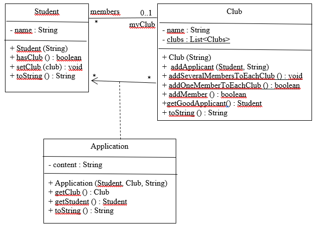

# TP6 : Méthodologie sur le projet "Etudients-Clubs"




Votre travail en équipe (trinôme/binôme) durant cette séance de TP sera évalué.


- La composition des équipes est imposée et votre travail va reprendre le projet ("Students-Clubs") étudié dans votre module ```R2.01 conception et programmation Objet```,
- Vous partez d'un projet gitlab existant créé avec un template de code maven/junit4 : un membre de votre équipe se verra attribuer le rôle ```Maintainer``` sur ce dépôt,
- Invitez les autres membres de l'équipe comme ```developer```.


On vous demande de mettre en application les différents outils vus durant ce module :

* tests (imposé),
* git (imposé),
* exceptions si la fonctionnalité le justifie (imposé),
* javadoc (imposé),
* couverture de test (recommandé),
* linter (recommandé).

Vous devez également écrire un `README.md` avec :

- ce qui a été fait, par qui, et qui marche,
- ce qui ne marche pas,
- le score couverture.


Votre méthodologie vue lors des deux premiers TPs (un dépôt git avec des branches, des tests écrits, des fonctionnalités documentées  validées puis poussées régulièrement, etc.) sera un point important de votre travail et sera aussi évaluée.

**Vous ferez référence aux étiquettes des besoins exprimés ci-dessous (`A`, `B`, ... ) pour nommer vos branches et les commits.**

Afin de cadrer votre travail sur la partie test, voici une liste de besoins pouvant être implémentés (```Backlog``` en méthode agile) et vous pouvez la compléter par vos propres idées de besoins (à condition de l'expliciter clairement dans votre `README.md`) :

- A. La capacité d'un club est au plus de 30 membres
- B. Les clubs ont des noms distincts
- C. Un étudiant a candidaté à au moins 2 clubs
- D. Chaque candidature a un score (note donnée par un rapporteur externe sur cette candidature)

- E. Chaque club sélectionne parmi les candidatures recues 
d'étudiant sans club la meilleur candidature (qui a le meilleur score). L'étudiant devient membre du club. 
- F.  L'opération précédent est répétée tant qu'il est possible d'affecter un étudiant à un club.

- G. Chaque membre d'un club  X a un score (qui est le score de la candidature de ce membre au club X)
- H Chaque club a une e-répudation : la moyenne des scores de ses membres
- I. Il existe un catalogue internet des clubs (name, capacité, e-reputation)  
où les clubs sont listés dans l'ordre de leur e-réputation

On s'attend à ce que chaque étudiant développe 2 fonctionnalités correctement testées et intégrées en suivant la méthodologie.

**barème indicatif** :

* readme : 2 pts
* code compile : 2 pts,  
* javadoc : 4 pts
* git : 4 pts 
* tests : 5 pts
* exception : 3 pts
